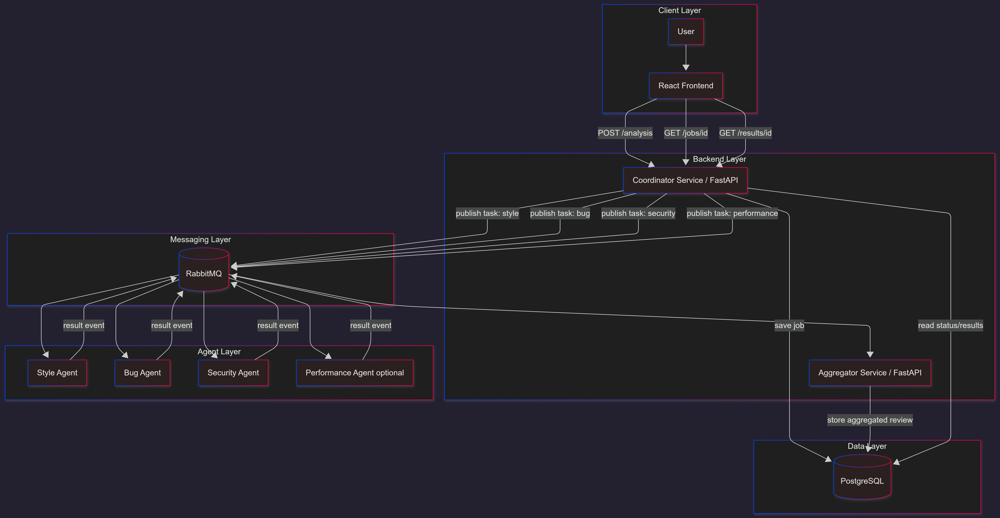

# System Design

---

The system conists of 3 Layers, each has own repo:

* Frontend Layer
* Backend Layer
* Agent Layer

(Optionally the DB Layer can be discussed)
---

# 🚀 Inspectra AI – Distributed Code Quality Analysis Platform
## 📌 Project Overview

Inspectra AI is a distributed AI-powered platform that analyzes source code using multiple specialized agents running in parallel.

The system delivers a structured, multi-dimensional code review, helping developers identify:

- Code quality and style issues
- Bugs and logical errors
- Security vulnerabilities
- Performance bottlenecks

Instead of relying on a single analysis tool, Inspectra AI combines multiple intelligent agents to produce a comprehensive and scalable review.

---

# 🎯 What the Product Does
## 👨‍💻 For Developers

With Inspectra AI, users can:

- Submit source code via a web interface or API
- Trigger an analysis job
- Receive a structured, aggregated review
## ⚙️ What Happens Behind the Scenes
- A job is created for each analysis request
- The job is distributed to multiple AI agents
- Each agent analyzes one aspect of the code
- Results are merged into a single final report

👉 This enables:

- Parallel execution
- Higher analysis quality
- Easy extensibility (plug-in new agents)
---

# 🧠 System Concept

### Inspectra AI is built as a distributed system, not a monolith:

- Independent services
- Network-based communication (REST + messaging)
- Parallel processing
- Clear separation of concerns

This architecture ensures scalability, flexibility, and maintainability.

--- 

# 🏗️ Architecture Overview

The system is structured into multiple layers:

## 1️⃣ Client Layer
- User
- React Frontend

Responsibilities:

- Code submission
- Triggering analysis
- Displaying results

## API Endpoints:

* POST /analysis → Start analysis
* GET /jobs/{id} → Job status
* GET /results/{id} → Final review
  
## 2️⃣ Backend Layer
### 🧩 Coordinator Service (FastAPI)

The central orchestration component.

Responsibilities:

- Receive requests
- Create and manage jobs
- Distribute tasks to agents
- Communicate via messaging
- Track job lifecycle

Publishes tasks such as:

- Style analysis
- Bug detection
- Security checks
- Performance analysis
  
## 📊 Aggregator Service (FastAPI)

Responsibilities:

- Collect results from agents
- Merge them into a unified review
- Store results
- Provide them to the frontend
## 3️⃣ Messaging Layer
🐇 RabbitMQ

The communication backbone of the system.

Responsibilities:

- Asynchronous communication
- Decoupling services
- Task distribution
- Result event handling
## 4️⃣ Agent Layer

Independent microservices:

- 🎨 Style Agent
- 🐞 Bug Detection Agent
- 🔐 Security Agent
- ⚡ Performance Agent (optional)

Responsibilities:

* Consume analysis tasks
* Process code
* Publish results

👉 Agents are scalable and replaceable.

## 5️⃣ Data Layer
### 🐘 PostgreSQL

Responsibilities:

- Store analysis jobs
- Store aggregated reviews
- Persist system state
- 
### 🔄 End-to-End Flow
- User submits code
- Coordinator creates job
- Tasks are published to RabbitMQ
- Agents process tasks in parallel
- Agents send results back
- Aggregator merges results
- Final review is returned to user
---
# 🧩 Why This Architecture?

Inspectra AI is designed to:

* Enable parallel AI analysis
* Maintain loose coupling between services
* Support scalability and modularity
* Allow easy extension with new agents

---
# 🛠️ Tech Stack (Planned)
Frontend: React
Backend: FastAPI
Messaging: RabbitMQ
Database: PostgreSQL
Deployment: Docker / Docker Compose
---
👥 Team & Process
1 Product Owner
1 Scrum Master
6 Developers
Scrum Setup
Sprint length: 1–2 weeks
Focus on MVP first
Deliver end-to-end functionality early
Iterate with incremental improvements
---
# 🧪 MVP Goal

The first version should:

* Accept code input
* Execute one working agent
* Return a structured result

Then expand step by step:

* Add more agents
* Improve aggregation
* Add persistence & UI enhancements
  
---
# 🔮 Future Extensions
- AI-based refactoring suggestions
- Language-specific analysis
- CI/CD integration
- Real-time result streaming
- Team collaboration features
---
# 📌 Summary

Inspectra AI is a distributed AI system that:

- Uses multiple specialized agents
- Runs analysis in parallel
- Aggregates results into a single review
- Follows a scalable microservice architecture
